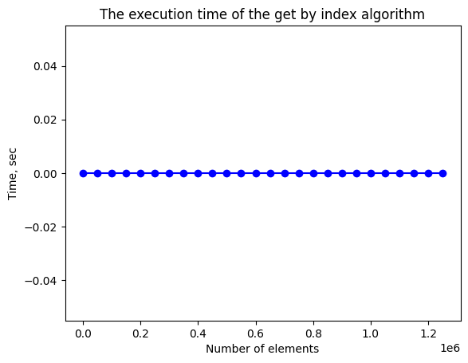
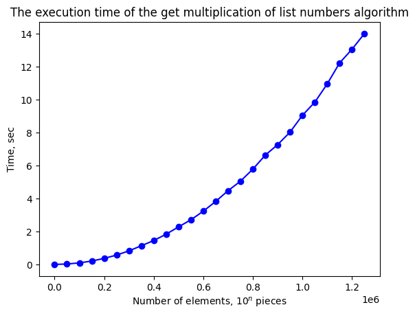
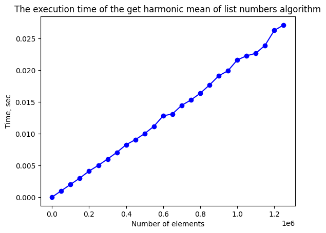

# Эмпирический анализ временной сложности алгоритмов
Фомин И.Н.  
ИУ10-37
## Задания
### Задание 1.1


```python
import random, usage_time
import matplotlib.pyplot as plt


def get_by_index(v: list):
    return v[random.randint(0, len(v)) - 1]

items = range(1, 10**5 * (20 - 7), 50000)
func = usage_time.get_usage_time()(get_by_index)
times = [
    func([
        random.randint(1, 3) 
        for _ in range(n)
    ]) 
    for n in items
]

fig = plt.plot(items, times, 'bo-')
ax = plt.gca()

plt.title('The execution time of the get by index algorithm')
ax.set_xlabel('Number of elements, $10^n$ pieces')
ax.set_ylabel('Time, sec')
```  

    


### Задание 1.3


```python
import random, usage_time
import matplotlib.pyplot as plt


def multiplication_nums(v: list):
    mult = 1
    for num in v:
        mult *= num
    return mult


items = range(1, 10**5 * (20 - 7), 50000)
func = usage_time.get_usage_time()(multiplication_nums)
times = [
    func([
        random.randint(1, 3) 
        for _ in range(n)
    ]) 
    for n in items
]

fig = plt.plot(items, times, 'bo-')
ax = plt.gca()

plt.title('The execution time of the get multiplication of list numbers algorithm')
ax.set_xlabel('Number of elements, $10^n$ pieces')
ax.set_ylabel('Time, sec')
```

    


### Задание 1.5


```python
import random, usage_time
import matplotlib.pyplot as plt


def get_max(v: list):
    max_num = 0
    for num in v:
        if num > max_num:
            max_num = num
    return max_num


items = range(1, 10**5 * (20 - 7), 50000)
func = usage_time.get_usage_time()(multiplication_nums)
times = [
    func([
        random.randint(1, 3) 
        for _ in range(n)
    ]) 
    for n in items
]

fig = plt.plot(items, times, 'bo-')
ax = plt.gca()

plt.title('The execution time of the get multiplication of list numbers algorithm')
ax.set_xlabel('Number of elements, $10^n$ pieces')
ax.set_ylabel('Time, sec')
```  

    


### Задание 1.8


```python
import random, usage_time
import matplotlib.pyplot as plt


def harmonic_mean(v: list):
    mean = len(v) / sum(map(
        lambda x: 1 / x,
        v
    ))
    return mean


items = range(1, 10**5 * (20 - 7), 50000)
func = usage_time.get_usage_time()(multiplication_nums)
times = [
    func([
        random.randint(1, 3) 
        for _ in range(n)
    ]) 
    for n in items
]

fig = plt.plot(items, times, 'bo-')
ax = plt.gca()

plt.title('The execution time of the get multiplication of list numbers algorithm')
ax.set_xlabel('Number of elements, $10^n$ pieces')
ax.set_ylabel('Time, sec')
```

    